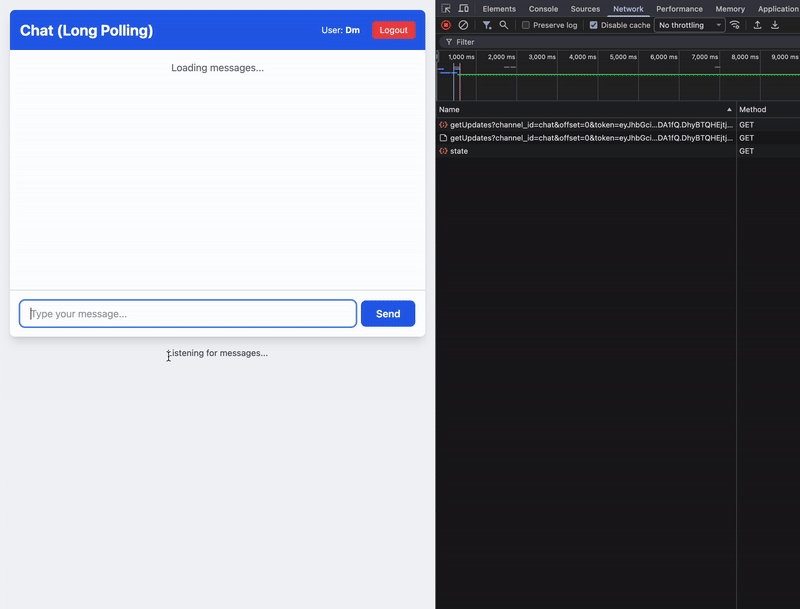

# Laravel Long-Polling Package

Laravel package that provides queue-backed long-polling primitives for Laravel apps while delegating delivery to the [Go Long-Polling Service](https://github.com/levskiy0/go-laravel-long-polling). Use it to keep Redis, database persistence, and API contracts in sync between PHP and Go runtimes.



## Features

- **Queue-Based Broadcasting** - events are persisted and dispatched through Laravel queues for reliable delivery.
- **Redis Fan-Out** - each broadcast notifies the Go service via Redis Pub/Sub so connected clients update instantly.
- **Typed PHP API** - a facade plus contract keep method names consistent across service providers and tests.
- **Secure REST Endpoint** - Go service fetches updates over a protected HTTP endpoint that validates secrets.
- **Testbench Coverage** - PHPUnit + Orchestra Testbench cover the package without needing a full Laravel install.

## Requirements

- PHP 8.1+
- Laravel 10/11/12 (or components via Illuminate packages)
- Redis server for Pub/Sub
- Queue worker configured for the broadcast queue

## Installation

1. **Install the package**
   ```bash
   composer require levskiy0/long-polling:^1.0
   ```
2. **Publish configuration**
   ```bash
   php artisan vendor:publish --tag=long-polling-config
   ```
3. **Configure environment** - add keys to `.env`:
   ```env
   LONGPOLLING_DRIVER=redis
   LONGPOLLING_GO_SERVICE_URL=http://localhost:8085
   LONGPOLLING_ACCESS_SECRET=shared_secret_between_laravel_and_go
   LONGPOLLING_BROADCAST_QUEUE=broadcast
   LONGPOLLING_REDIS_CONNECTION=default
   LONGPOLLING_REDIS_CHANNEL=longpoll:events
   ```
4. **Run migrations**
   ```bash
   php artisan migrate
   ```
5. **Start a queue worker**
   ```bash
   php artisan queue:work --queue=broadcast
   ```

## Configuration

`config/long-polling.php` exposes defaults for the driver, Go-service URL, shared secret, queue, and Redis connection. Update the array below to match your infrastructure:

```php
return [
    'driver' => env('LONGPOLLING_DRIVER', 'redis'),
    'go_service_url' => env('LONGPOLLING_GO_SERVICE_URL', 'http://localhost:8085'),
    'access_secret' => env('LONGPOLLING_ACCESS_SECRET', 'shared_secret_between_laravel_and_go'),
    'broadcast_queue' => env('LONGPOLLING_BROADCAST_QUEUE', 'broadcast'),
    'redis' => [
        'connection' => env('LONGPOLLING_REDIS_CONNECTION', 'default'),
        'channel' => env('LONGPOLLING_REDIS_CHANNEL', 'longpoll:events'),
    ],
];
```

## Usage

### Broadcasting Events

```php
use Levskiy0\LongPolling\Facades\LongPolling;

LongPolling::broadcast('user-123', [
    'type' => 'notification',
    'message' => 'You have a new message',
    'data' => [
        'sender' => 'John Doe',
        'timestamp' => now()->toISOString(),
    ],
]);
```

### Client Integration

```javascript
async function poll(offset = 0) {
  const tokenResponse = await fetch('/api/longpolling/token', {
    method: 'POST',
    body: JSON.stringify({ channel_id: 'user-123' }),
    headers: { 'Content-Type': 'application/json' }
  });
  const { token } = await tokenResponse.json();

  while (true) {
    const response = await fetch(
      `http://localhost:8085/getUpdates?token=${token}&offset=${offset}`
    );
    const { events } = await response.json();

    events.forEach(event => {
      // Update UI with each event
    });

    offset = events.length ? events[events.length - 1].id : offset;
  }
}

poll();
```

## Example: Real-Time Chat

### Controller

```php
<?php

namespace App\Http\Controllers;

use Illuminate\Http\JsonResponse;
use Illuminate\Http\Request;
use Illuminate\View\View;
use Levskiy0\LongPolling\Contracts\LongPollingContract;
use Levskiy0\LongPolling\Facades\LongPolling;

class ChatController extends Controller
{
    private const CHANNEL_ID = 'chat';

    public function index(): View
    {
        return view('chat.index');
    }

    public function sendMessage(Request $request): JsonResponse
    {
        $request->validate([
            'message' => 'required|string|max:1000',
        ]);

        LongPolling::broadcast(self::CHANNEL_ID, [
            'type' => 'message',
            'user_id' => $request->user()->id,
            'user_name' => $request->user()->name,
            'message' => $request->string('message'),
            'timestamp' => now()->toISOString(),
        ]);

        return response()->json(['success' => true]);
    }

    public function getState(LongPollingContract $driver): JsonResponse
    {
        $lastOffset = LongPolling::getLastOffset(self::CHANNEL_ID);
        $offsetWithMargin = max(0, $lastOffset - 10);

        $getUpdatesUrl = sprintf(
            '%s/getUpdates?channel_id=%s',
            config('long-polling.go_service_url'),
            self::CHANNEL_ID
        );

        return response()->json([
            'offset' => $offsetWithMargin,
            'token' => $driver->getToken(self::CHANNEL_ID),
            'get_updates_url' => $getUpdatesUrl,
        ]);
    }
}
```

### Routes

```php
use App\Http\Controllers\ChatController;

Route::middleware('auth')->group(function () {
    Route::get('/chat', [ChatController::class, 'index'])->name('chat.index');
    Route::get('/chat/state', [ChatController::class, 'getState'])->name('chat.state');
    Route::post('/chat/send', [ChatController::class, 'sendMessage'])->name('chat.send');
});
```

### Frontend Script

```html
<script type="module">
  let currentOffset = 0;
  let pollingActive = false;
  let getUpdatesUrl = '';
  let token = '';

  async function initialize() {
    const response = await fetch('/chat/state');
    const data = await response.json();

    currentOffset = data.offset;
    getUpdatesUrl = data.get_updates_url;
    token = data.token;

    startLongPolling();
  }

  function startLongPolling() {
    if (pollingActive) return;
    pollingActive = true;
    pollForMessages();
  }

  async function pollForMessages() {
    while (pollingActive) {
      try {
        const url = `${getUpdatesUrl}&offset=${currentOffset}&token=${encodeURIComponent(token)}`;
        const response = await fetch(url);
        const data = await response.json();

        if (data.events?.length) {
          data.events.forEach(displayMessage);
          currentOffset = data.events[data.events.length - 1].id;
        }
      } catch (error) {
        console.error('Polling error:', error);
        await new Promise(resolve => setTimeout(resolve, 3000));
      }
    }
  }

  async function sendMessage(message) {
    await fetch('/chat/send', {
      method: 'POST',
      headers: {
        'Content-Type': 'application/json',
        'X-CSRF-TOKEN': document.querySelector('meta[name="csrf-token"]').content,
      },
      body: JSON.stringify({ message }),
    });
  }

  function displayMessage(event) {
    const payload = event.event;
    console.log(`${payload.user_name}: ${payload.message}`);
  }

  initialize();
</script>
```

### Local Services

```bash
# Terminal 1 - Laravel HTTP server
cd laravel && php artisan serve

# Terminal 2 - Queue worker
php artisan queue:work --queue=broadcast

# Terminal 3 - Redis
redis-server

# Terminal 4 - Go long-polling service
cd go-service && go run main.go
```

### Request Flow

1. User opens `/chat`; frontend requests `/chat/state` to fetch offset, JWT token, and Go-service URL.
2. User posts `/chat/send`; Laravel stores the event and notifies Redis; the Go service fetches and pushes it to waiting clients.
3. Frontend polls `${get_updates_url}&offset=${currentOffset}&token=${token}`; the Go service blocks until new events exist, returns them, and the client resumes polling with the new offset.

## Available Methods

```php
use Levskiy0\LongPolling\Facades\LongPolling;

$offset = LongPolling::getLastOffset('chat');
$events = LongPolling::getLastEvents('chat', 10);
$updates = LongPolling::getUpdates('chat', fromOffset: 100, limit: 50);
$token = app(\Levskiy0\LongPolling\Contracts\LongPollingContract::class)
    ->getToken('chat');
```

## Production Considerations

- Run multiple queue workers under Supervisor or Horizon for resiliency.
- Host Redis with persistence and monitoring; adjust `redis.channel` for multi-tenant deployments.
- Place the Go service behind TLS (Nginx or similar) and rotate `LONGPOLLING_ACCESS_SECRET` regularly.
- Rate-limit `/chat/send` (or similar endpoints) and authenticate all routes consuming the package.

## API Reference

### `LongPolling::broadcast(int|string $channelId, array $payload): void`
Queues and stores an event, then notifies the Go service via Redis.

### `GET /api/long-polling/getEvents`
Internal endpoint consumed by the Go service.

Query parameters: `channel_id`, `secret`, optional `offset` (default `0`) and `limit` (default `100`).

```json
{
  "events": [
    {
      "id": 1,
      "event": { "type": "message", "data": "..." },
      "created_at": 1699876543
    }
  ],
  "count": 1
}
```

## Database Schema

`long_polling_events`

| Column      | Type    | Description                  |
|-------------|---------|------------------------------|
| `id`        | bigint  | Primary key                  |
| `channel_id`| string  | Channel identifier (indexed) |
| `event`     | longtext| JSON-encoded payload         |
| `created_at`| timestamp| Event creation time          |

Indexes: `channel_id`, `(channel_id, id)` for fast offset queries.

## Testing

Run the package test suite via Orchestra Testbench:

```bash
composer install
./vendor/bin/phpunit --testdox
```

## License

MIT
